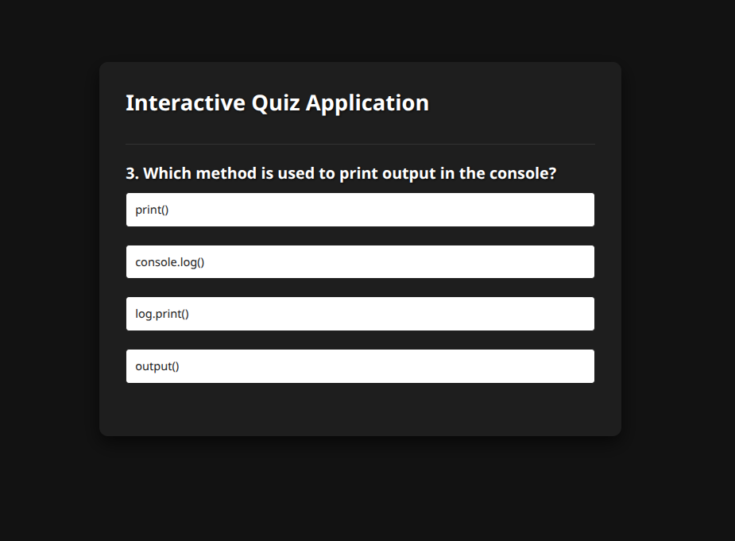

# 📝 Interactive JavaScript Quiz App

An interactive **JavaScript-based multiple-choice quiz application**.  
It displays one question at a time, lets the user select an answer, highlights correct/incorrect answers, and shows the **final score** at the end.

---

## --- 📌 Features
- 🎯 Multiple-choice questions  
- 🖱️ Click to select an answer  
- ✅ Highlights correct and ❌ incorrect answers  
- 📊 Displays score at the end  
- 🔄 Play again option  

---

## --- 📸 Preview
<!-- Add your own screenshot -->


---

## --- 🌐 Live Demo
👉 [Click here to try the app](https://interactivequix.netlify.app/)

---

## --- 🛠️ Tech Stack
- **HTML5** – Structure of the quiz  
- **CSS3** – Styling and layout  
- **JavaScript (Vanilla JS)** – Functionality, event handling, and score tracking  

---

## --- 📂 Project Structure
│── index.html # Main HTML structure
│── style.css # Styling for quiz
│── script.js # Core JavaScript logic
│── README.md # Documentation


---

## --- ⚙️ How It Works
1. **Load questions** from `script.js`  
2. **Render** the current question & answer options  
3. **Wait** for the user to click an answer  
4. **Highlight** correct/incorrect choices  
5. **Go to next question** until the quiz ends  
6. **Show final score** and allow replay  

---

## --- 🚀 Installation & Usage
1. **Clone the repository**
   ```bash
   git clone https://github.com/HsrRaza/Interactive-Quiz-Application


--- 📝 Example Question Data
const questions = [
  {
    question: "Which language runs in a web browser?",
    answers: [
      { text: "Java", correct: false },
      { text: "C", correct: false },
      { text: "Python", correct: false },
      { text: "JavaScript", correct: true }
    ]
  }
];
